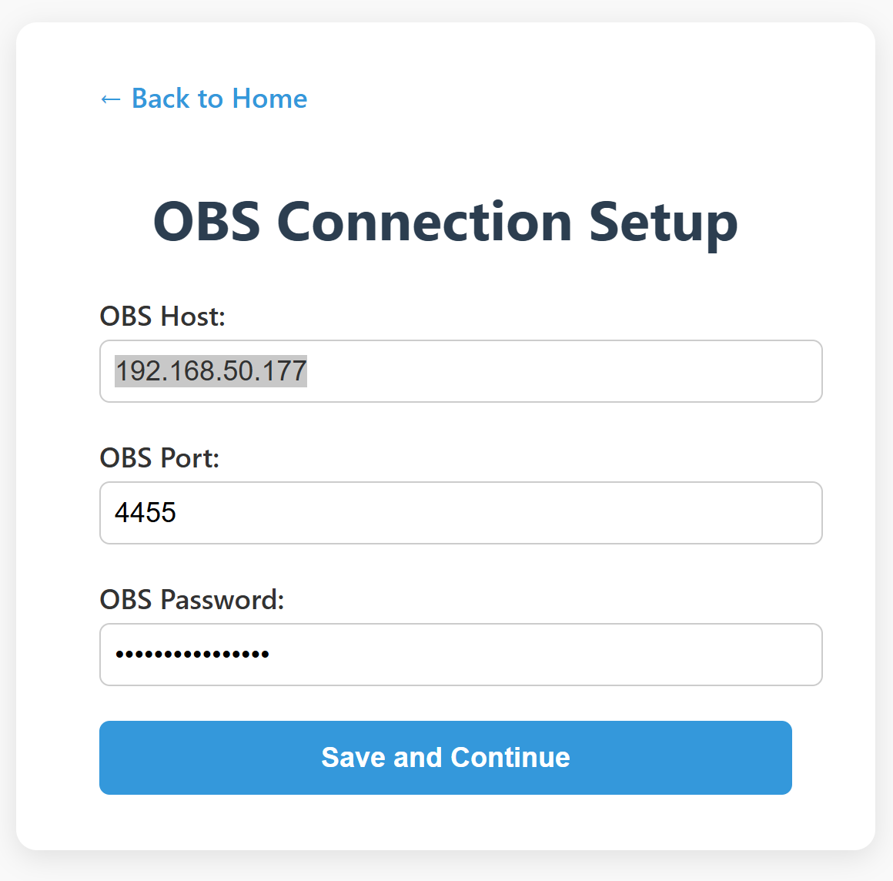
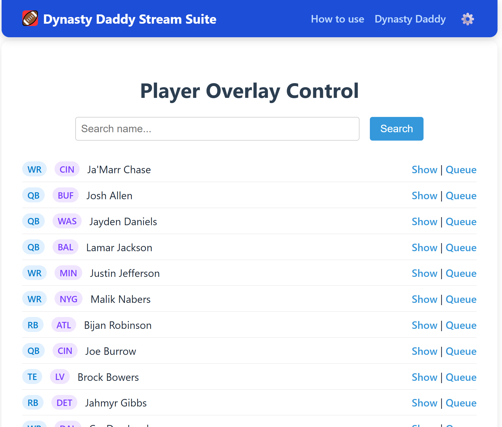
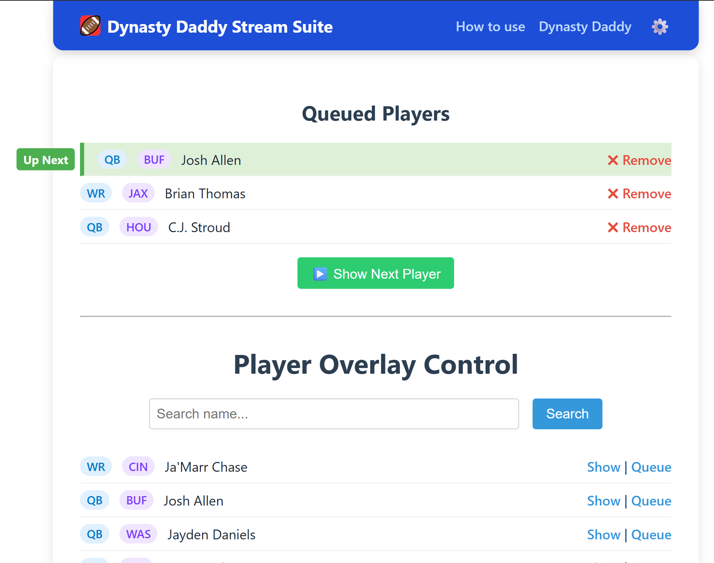
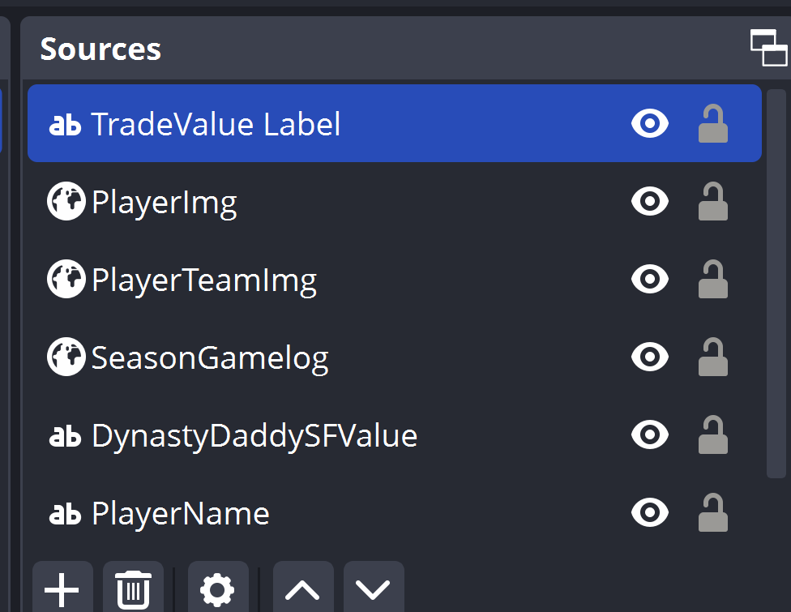
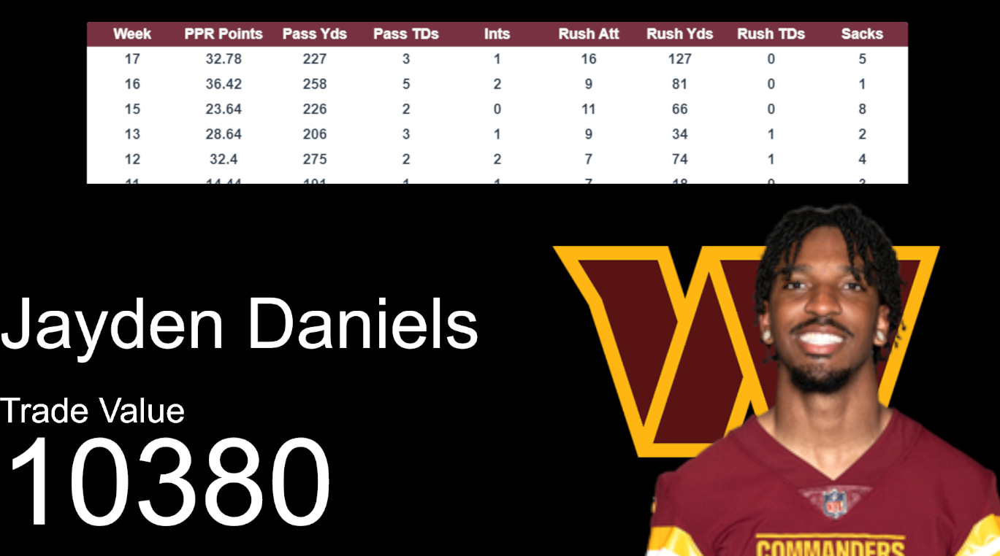
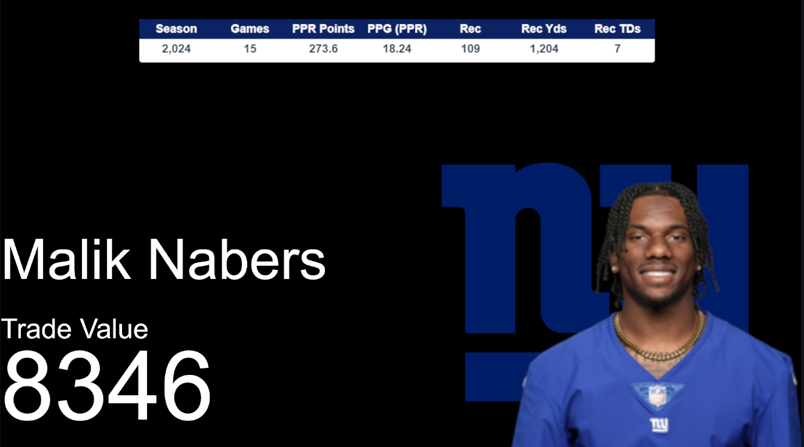

# Dynasty Daddy Stream Suite

A simple Python tool that connects to OBS using WebSocket and dynamically updates:

- Player name, team, and stats (text sources)  
- Player image (image source)  
- Overlay background color (via hex code from API using a color filter)  

Perfect for fantasy football, live streams, or sports podcasts!

## 📦 Download

Grab the latest version of the Stream Suite for your platform:

- 🪟 [Download for Windows (.exe)](https://github.com/Dynasty-Daddy/stream-tools/releases/latest/download/stream-suite.exe)
- 🍎 [Download for macOS (.zip)](https://github.com/Dynasty-Daddy/stream-tools/releases/latest/download/stream-suite-mac.zip) (coming soon)

> ℹ️ Make sure to allow the app through your firewall and OBS WebSocket settings.

---

## ✅ Requirements

### OBS Setup

- Install OBS Studio: https://obsproject.com/  
- Install OBS WebSocket Plugin: https://github.com/obsproject/obs-websocket/releases  
  (If you're using OBS 28+, WebSocket is built-in)

Then:

1. Open OBS  
2. Go to **Tools → WebSocket Server Settings**  
3. Enable WebSocket server  
4. Note the port (default: 4455) and password



---

## ❔ How to use

After connected, you can select a player to show stats and info about that player. Search for players and queue players up so you can just press show next to update your overlays.



Here's what a queue looks like when building a show sheet...



### Examples

Here's a very simple example that displays name, trade value, player & team image, and a table of stats. After configuring OBS by naming the fields to match the table below I can now populate information with ease.



(Here are my sources)

Let's select Jayden Daniels from the tool, and this is what I see.



Now let's select Malik Nabers. With not changes to my overlay, everything updates automatically!



(Note: I changed the table to be season gamelogs here)

---

## 🎯 OBS Scene Setup

Create the following sources in your OBS scene **with exact names**:

| Field Name                 | OBS Type     | Description                                            |
| -------------------------- | ------------ | ------------------------------------------------------ |
| **Core Info**              |              |                                                        |
| PlayerName                 | Text (GDI+)  | Full name of the player                                |
| PlayerFirstName            | Text (GDI+)  | Player's first name                                    |
| PlayerLastName             | Text (GDI+)  | Player's last name                                     |
| PlayerTeam                 | Text (GDI+)  | Player's team abbreviation (e.g., "NE", "DAL")         |
| PlayerPosition             | Text (GDI+)  | Player's position (e.g., "QB", "RB")                   |
| PlayerAge                  | Text (GDI+)  | Player's age                                           |
| PlayerExperience           | Text (GDI+)  | Years of experience in the league                      |
| PlayerInjuryStatus         | Text (GDI+)  | Injury status (e.g., "Healthy", "Out", "Questionable") |
| **Visuals**                |              |                                                        |
| PlayerImg                  | Browser      | Image of the player                                    |
| PlayerTeamImg              | Browser      | Image of the player's team logo                        |
| PlayerOverlayBox           | Color Source | Set the color source to the color of the team          |
| **Tables**                 |              |                                                        |
| SeasonGamelogs             | Browser      | Table of past 3 season of stats                        |
| WeeklyGamelogs             | Browser      | Table of most recent seasons weekly gamelogs           |
| **KeepTradeCut (KTC)**     |              |                                                        |
| KeepTradeCutSFValue        | Text (GDI+)  | KeepTradeCut superflex trade value                     |
| KeepTradeCut1QBValue       | Text (GDI+)  | KeepTradeCut 1QB trade value                           |
| KeepTradeCutSFPosRank      | Text (GDI+)  | KeepTradeCut superflex position rank                   |
| KeepTradeCut1QBPosRank     | Text (GDI+)  | KeepTradeCut 1QB position rank                         |
| KeepTradeCutSFRank         | Text (GDI+)  | KeepTradeCut superflex overall rank                    |
| KeepTrade1QBCutRank        | Text (GDI+)  | KeepTradeCut 1QB overall rank                          |
| **Dynasty Daddy**          |              |                                                        |
| DynastyDaddySFValue        | Text (GDI+)  | Dynasty Daddy superflex trade value                    |
| DynastyDaddy1QBValue       | Text (GDI+)  | Dynasty Daddy 1QB trade value                          |
| DynastyDaddySFPosRank      | Text (GDI+)  | Dynasty Daddy superflex position rank                  |
| DynastyDaddy1QBPosRank     | Text (GDI+)  | Dynasty Daddy 1QB position rank                        |
| DynastyDaddySFRank         | Text (GDI+)  | Dynasty Daddy superflex overall rank                   |
| DynastyDaddy1QBCutRank     | Text (GDI+)  | Dynasty Daddy 1QB overall rank                         |
| **Fantasy Daddy**          |              |                                                        |
| FantasyDaddySFValue        | Text (GDI+)  | Fantasy Daddy superflex trade value                    |
| FantasyDaddy1QBValue       | Text (GDI+)  | Fantasy Daddy 1QB trade value                          |
| FantasyDaddySFPosRank      | Text (GDI+)  | Fantasy Daddy superflex position rank                  |
| FantasyDaddy1QBPosRank     | Text (GDI+)  | Fantasy Daddy 1QB position rank                        |
| FantasyDaddySFRank         | Text (GDI+)  | Fantasy Daddy superflex overall rank                   |
| FantasyDaddy1QBRank        | Text (GDI+)  | Fantasy Daddy 1QB overall rank                         |
| **ADP Daddy**              |              |                                                        |
| ADPDaddy1QBSFValue         | Text (GDI+)  | ADP Daddy superflex trade value                        |
| ADPDaddy1QBValue           | Text (GDI+)  | ADP Daddy 1QB trade value                              |
| ADPDaddySFPosRank          | Text (GDI+)  | ADP Daddy superflex position rank                      |
| ADPDaddy1QBPosRank         | Text (GDI+)  | ADP Daddy 1QB position rank                            |
| ADPDaddySFRank             | Text (GDI+)  | ADP Daddy superflex overall rank                       |
| ADPDaddy1QBRank            | Text (GDI+)  | ADP Daddy 1QB overall rank                             |
| **ADP RD Daddy**           |              |                                                        |
| ADPDaddyRDSFValue          | Text (GDI+)  | ADP RD Daddy superflex trade value                     |
| ADPDaddyRD1QBValue         | Text (GDI+)  | ADP RD Daddy 1QB trade value                           |
| ADPDaddyRDSFPosRank        | Text (GDI+)  | ADP RD Daddy superflex position rank                   |
| ADPDaddyRD1QBPosRank       | Text (GDI+)  | ADP RD Daddy 1QB position rank                         |
| ADPDaddyRDSFRank           | Text (GDI+)  | ADP RD Daddy superflex overall rank                    |
| ADPDaddyRD1QBRank          | Text (GDI+)  | ADP RD Daddy 1QB overall rank                          |
| **Fantasy Points & Stats** |              |                                                        |
| PlayerDaddyADP             | Text (GDI+)  | Dynasty Daddy ADP (Average Draft Position)             |
| PlayerUnderdogADP          | Text (GDI+)  | Underdog ADP                                           |
| PlayerAvgADP               | Text (GDI+)  | Average ADP across platforms                           |
| PlayerPPRPoints            | Text (GDI+)  | Total PPR fantasy points                               |
| PlayerTotalHalfPPR         | Text (GDI+)  | Total Half-PPR fantasy points                          |
| PlayerTotalPPR             | Text (GDI+)  | Total PPR fantasy points                               |
| PlayerTotalSTD             | Text (GDI+)  | Total Standard scoring fantasy points                  |
| PlayerPPGHalfPPR           | Text (GDI+)  | Average fantasy points per game (Half-PPR)             |
| PlayerPPGPPR               | Text (GDI+)  | Average fantasy points per game (PPR)                  |
| PlayerPPGSTD               | Text (GDI+)  | Average fantasy points per game (Standard)             |
| PlayerReceptions           | Text (GDI+)  | Total receptions                                       |
| PlayerReceivingYards       | Text (GDI+)  | Total receiving yards                                  |
| PlayerReceivingTDs         | Text (GDI+)  | Total receiving touchdowns                             |
| PlayerRushingAttempts      | Text (GDI+)  | Total rushing attempts                                 |
| PlayerRushingYards         | Text (GDI+)  | Total rushing yards                                    |
| PlayerRushingTDs           | Text (GDI+)  | Total rushing touchdowns                               |
| PlayerPassingYards         | Text (GDI+)  | Total passing yards                                    |
| PlayerPassingTDs           | Text (GDI+)  | Total passing touchdowns                               |
| PlayerInterceptions        | Text (GDI+)  | Total interceptions                                    |
| PlayerGamesPlayed          | Text (GDI+)   | Total games played                                     |

---

### Add Table Type to OBS

1. Create a Browser source called `SeasonGamelogs` or `WeeklyGamelogs` in OBS  
2. Right-click & Select **Properties**
3. Set the URL to the following

| Field Name                 | URL                                                  |
| -------------------------- | ---------------------------------------------------- |
| SeasonGamelogs             | http://127.0.0.1:5000/player_gamelogs_by_season      |
| WeeklyGamelogs              | http://127.0.0.1:5000/player_gamelogs_by_week        |

---

### Add TeamColorFilter to PlayerOverlayBox

1. Create a color source called `PlayerOverlayBox` in OBS  
2. Right-click & Select **Filters**  
3. Click `+` → Add **Color Correction**  
4. Name it **TeamColorFilter**

---

## Development


### ⚙️ Configuration with .env File
You can configure the connection to your OBS WebSocket server by creating a `.env` file in the project root directory.

Create `.env` file from the `.env.template`.
Add the following variables:

```
OBS_HOST=localhost
OBS_PORT=4455
OBS_PASSWORD=your_password_here
```

OBS_HOST: The hostname or IP address of your OBS WebSocket server (usually localhost if running locally)
OBS_PORT: The port number of the WebSocket server (default is 4455)
OBS_PASSWORD: The password you set for your OBS WebSocket server (can be empty if no password set)

### Running the project

1. (Optional) Create and activate a virtual environment  
2. Install dependencies: `pip install -r requirements.txt`  
3. Build a standalone executable with:

```bash
pyinstaller --onefile --add-data "static;static" --icon=static/favicon.ico dynasty_daddy_stream_tools.py
```

---

## 🧠 Credits

Built using [OBS WebSocket Python API](https://github.com/Elektordi/obs-websocket-py)
